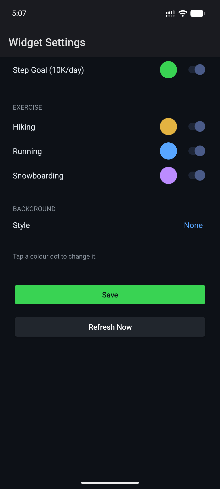

# Health Activity Widget

 

An Android home-screen widget that displays your Health Connect activity as a GitHub-style contribution calendar grid.

Each column is a week, each row a day of the week. Cells light up when you hit your activity goals:

- **Step goal** — 10,000 steps/day
- **Exercise sessions** — any recorded exercise type

Days with multiple activity types show colour bands. The widget refreshes hourly in the background. 

## How to use it

Once installed, add the 2x1 Health Activity Widget to one of your screens.

Click the widget once to open the permissions screen to allow the widget to access information stored in your Android's Health Connect. 

> **Health Connect** is a central data store on your phone that can aggregate fitness and other health data from various apps on your phone like Garmin Connect. You'll separately want to enable your other apps to sync with it by going to **Settings > Search > Health Connect**.

Any stored activities in the time range should then be loaded into the app. Once that's done, you can click the widget again to configure it.

 

## Features

- 13-week contribution grid (resizable)
- Per-activity-type colour coding with colour picker
- Toggle individual activity types on/off
- Reads data from Android Health Connect — no data leaves your device
- No ads, no tracking, no internet permission

## Requirements

- Android 8.0 (API 26) or higher
- [Health Connect](https://play.google.com/store/apps/details?id=com.google.android.apps.healthdata) installed and containing activity data

> **Note for de-Googled ROMs:** Health Connect is a Google app. If it is not installed, the widget will display a prompt to grant permissions that cannot be fulfilled.

## Building
I usually build this with android sdk v36.x or v37
```bash
./gradlew assembleRelease
```

The APK will be at `app/build/outputs/apk/release/app-release-unsigned.apk`.

## Privacy

All data is read locally from Health Connect and never transmitted anywhere. See [privacy_policy.html](privacy_policy.html) for the full policy.

## License

MIT — see [LICENSE](LICENSE).
